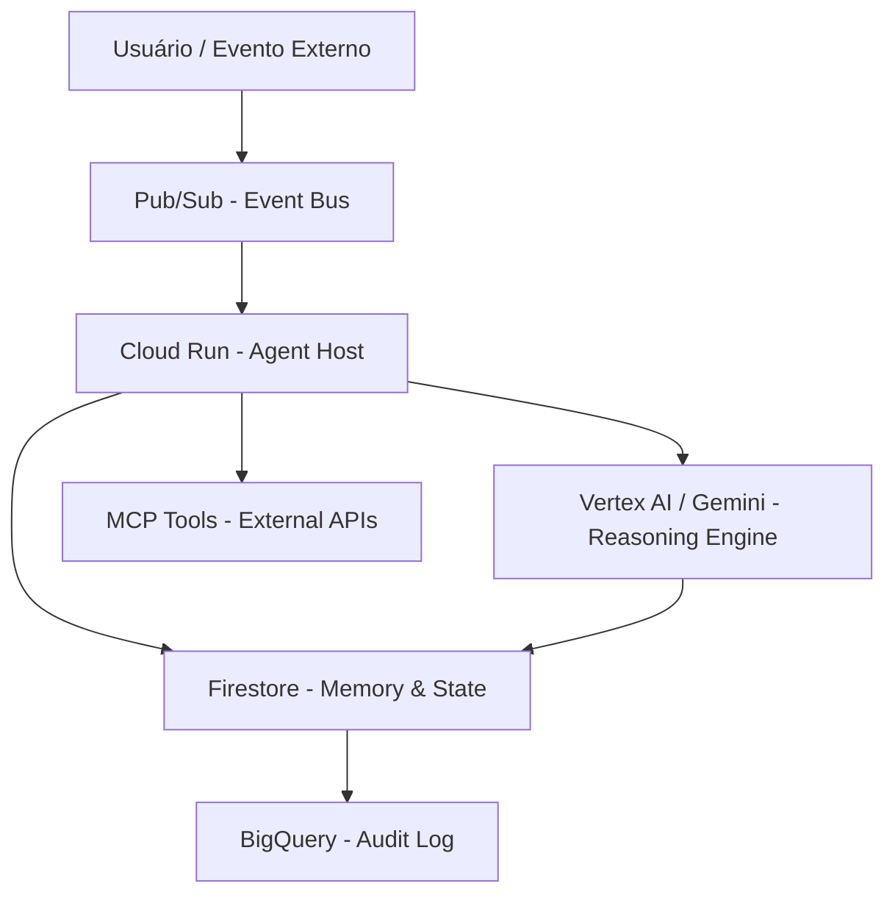
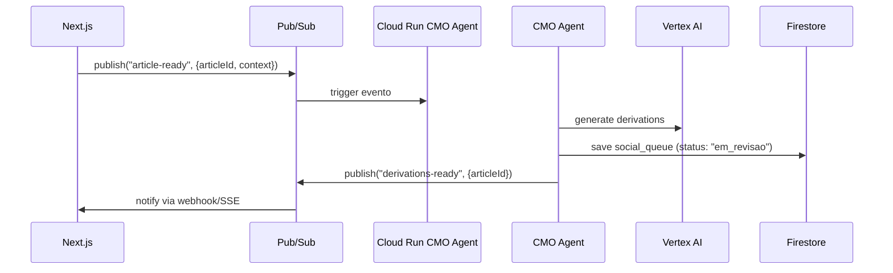

# Padrões de Agentic AI no Google Cloud (GCP)

> Fonte: Documentação Google Cloud (cloud.google.com), Google ADK Docs (adk.dev), pesquisa técnica especializada — Junho 2026.
> Leia antes de arquitetar qualquer componente agêntico no GCP para a plataforma éozoré.

---

## 1. Stack Canônico de Agentic AI no GCP (2025–2026)

A arquitetura padrão recomendada pela Google é orientada a eventos e desacopla as camadas de raciocínio, estado e execução:



| Camada | Serviço GCP | Papel |
|---|---|---|
| **Raciocínio** | Vertex AI / Gemini API | Modelo de linguagem central (LLM como orchestrador) |
| **Definição de Lógica** | Agent Development Kit (ADK) | Framework Python para definir agentes, tools, fluxos |
| **Execução Serverless** | Cloud Run | Deploy containerizado do agente, escala para zero |
| **Estado & Memória** | Firestore | Curto prazo (sessão) e longo prazo (preferências, histórico) |
| **Event Bus** | Pub/Sub | Desacoplamento de eventos para workflows assíncronos |
| **Produção Gerenciada** | Vertex AI Agent Engine | Runtime gerenciado para produção enterprise |
| **Auditoria** | BigQuery + Cloud Logging | Rastreamento de decisões e chamadas de tools |

---

## 2. Tipos de Memória e Onde Armazenar

Os agentes ADK gerenciam 3 tipos de memória com backends diferentes no GCP:

| Tipo | Escopo | Storage Recomendado | Latência |
|---|---|---|---|
| **Session Events** | 1 sessão | Firestore (ou `InMemorySessionService` em dev) | Baixa |
| **Session State** | 1 sessão | Firestore | Baixa |
| **Long-Term Memory** | Cross-session | Firestore (key-value) + Vertex AI Vector Search (semântico) | Média |

### Implementação com Firestore (Short + Long Term)

```python
# ADK com Firestore como backend de sessão
from google.adk.sessions import FirestoreSessionService

session_service = FirestoreSessionService(
    project_id="eozore-platform",
    collection="agent_sessions",
)

# Vertex AI Memory Bank (long-term, cross-session)
from google.adk.memory import VertexAiMemoryBankService

memory_service = VertexAiMemoryBankService(
    project="eozore-platform",
    location="us-central1",
)
```

> **Nota da plataforma éozoré:** A memória de curto prazo atual usa o histórico de mensagens em memória React (`chatHistory` no `DraftState`). A evolução natural é persistir essa sessão no Firestore com `conversation_id` como chave, habilitando retomada de sessão entre abas ou dias.

---

## 3. Padrões de Orquestração Multi-Agente

### Padrão 1: Orquestrador → Workers (Recomendado para éozoré)
```
CMO Orchestrator Agent
├── Research Worker (arXiv, tendências de mercado)
├── Writing Worker (Redator técnico LaTeX + Mermaid)
├── SEO Worker (análise de palavras-chave)
└── Distribution Worker (LinkedIn, YouTube, Instagram)
```

### Padrão 2: Evaluator-Optimizer (Controle de qualidade)
```
Draft Writer Agent → Quality Evaluator Agent → [PASS: Publish] / [FAIL: Loop back]
```

### Padrão 3: Hierárquico com Supervisor
Recomendado quando agentes precisam de aprovação humana antes de publicar:
```
Supervisor Agent (CEO Victor = human-in-the-loop)
└── Aprova/rejeita outputs dos sub-agentes antes de ir ao Firestore `approved`
```

---

## 4. Cloud Run: Melhores Práticas para Agentes

Como agentes são **stateful e de longa duração**, e Cloud Run é **stateless**, é necessário:

### 4.1 Externalizar Estado
```python
# ❌ NÃO armazene estado em variável Python local em Cloud Run
agent_state = {}  # Reset a cada novo request

# ✅ Use Firestore para persistir entre requests
db.collection("agent_sessions").document(session_id).set({"state": ...})
```

### 4.2 Tornar Agentes Resumíveis
```python
# Grave cada passo do loop agêntico no Firestore
# Se o container reiniciar, o agente retoma do último checkpoint

async def save_checkpoint(session_id: str, step: int, state: dict):
    db.collection("agent_checkpoints").document(session_id).set({
        "last_step": step,
        "state": state,
        "updated_at": firestore.SERVER_TIMESTAMP,
    })
```

### 4.3 Configuração de Timeout
```yaml
# Cloud Run timeout para agentes de longa duração
# cloud-run.yaml
timeout: 3600  # 1 hora (máximo)
concurrency: 1  # 1 request por instância para agentes stateful
memory: 2Gi
cpu: 2
```

### 4.4 Identidade de Serviço (sem chaves JSON)
```bash
# Associar Service Account ao Cloud Run (nunca usar chaves JSON em produção)
gcloud run deploy csm-agent \
  --service-account=csm-agent-sa@eozore-platform.iam.gserviceaccount.com \
  --region=us-central1
```

IAM Roles necessários para o Service Account do agente:
- `roles/aiplatform.user` — Vertex AI Gemini
- `roles/datastore.user` — Firestore (memória)
- `roles/pubsub.subscriber` — Pub/Sub (event bus)

---

## 5. Autenticação ADC (Application Default Credentials)

**Regra de ouro:** Nunca embed service account keys no código ou no repositório.

### Hierarquia de busca de credenciais ADC:
1. Variável de ambiente `GOOGLE_APPLICATION_CREDENTIALS` (apontando para JSON local em dev)
2. `gcloud auth application-default login` (desenvolvimento local)
3. Service Account anexado ao recurso de computação (Cloud Run, GKE, Cloud Functions) — **Produção**

### Implementação na plataforma éozoré (Next.js + Firebase Admin):
```typescript
// src/lib/firebase.ts — ADC automático no Cloud Run
import { initializeApp, cert, getApps } from 'firebase-admin/app';

// Em Cloud Run: ADC detectado automaticamente pelo Firebase Admin SDK
// Em dev local: usa GOOGLE_APPLICATION_CREDENTIALS ou gcloud ADC
if (!getApps().length) {
  initializeApp(); // Zero config — ADC automático
}
```

### Para chamadas REST ao Vertex AI (padrão do projeto):
```typescript
// src/lib/vertex.ts — token OAuth2 via Firebase Admin ADC
import { getApps } from 'firebase-admin/app';

export async function getVertexAccessToken(): Promise<string> {
  const app = getApps()[0];
  const tokenResult = await app.options.credential!.getAccessToken();
  return tokenResult.access_token;
}
```

---

## 6. Pub/Sub como Event Bus Agêntico

Para desacoplar o front-end (Next.js) dos agentes Python (Cloud Run):



```python
# Cloud Run: consumindo evento de artigo publicado
from google.cloud import pubsub_v1
import json

def handle_article_ready(message):
    data = json.loads(message.data.decode("utf-8"))
    article_id = data["articleId"]
    # Chamar CMO agent para derivar conteúdo omnicanal
    asyncio.run(run_cmo_derivation_agent(article_id))
    message.ack()
```

---

## 7. Vertex AI Agent Engine vs Cloud Run: Quando Usar Cada Um

| Critério | Cloud Run | Vertex AI Agent Engine |
|---|---|---|
| **Controle** | Total (você gerencia tudo) | Gerenciado (Google gerencia infra) |
| **Custo** | Menor em volume baixo | Maior (managed overhead) |
| **Escalabilidade** | Manual/config | Automática |
| **Integração GCP** | Requer configuração explícita | Nativa (Firestore, Logging) |
| **Recomendação éozoré** | ✅ Fase 1 (MVP agêntico) | Fase 2 (quando escala) |

---

## 8. Observabilidade com OpenTelemetry

```python
# Rastrear cada turn do agente com spans customizados
from opentelemetry import trace
from opentelemetry.sdk.trace import TracerProvider

tracer = trace.get_tracer("csm-agent")

async def run_interview_turn(topic: str, history: list):
    with tracer.start_as_current_span("cmo_interview_turn") as span:
        span.set_attribute("topic", topic)
        span.set_attribute("history_length", len(history))
        result = await gemini_call(topic, history)
        span.set_attribute("output_tokens", result.token_count)
        return result
```

---

## Referências
- Google ADK Docs: https://google.github.io/adk-docs/
- Vertex AI Agent Engine: https://cloud.google.com/vertex-ai/docs/agent-engine
- Cloud Run for AI Agents: https://cloud.google.com/run/docs/
- ADC Documentation: https://cloud.google.com/docs/authentication/application-default-credentials
- Agent2Agent Protocol (A2A): https://github.com/google-a2a/A2A
