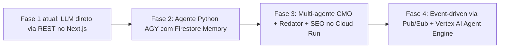

# Contexto Técnico do Projeto: Plataforma éozoré

> Este documento é a bíblia técnica do repositório `zore-portfolio`. Qualquer agente de IA que atuar neste projeto DEVE ler este arquivo antes de propor qualquer alteração arquitetural.

---

## 1. Visão Geral da Plataforma

**Repositório:** `eozore/zore-portfolio`
**Descrição:** Portfólio pessoal em transição para plataforma educacional de IA/ML + suíte de ferramentas de marketing geradas por IA.
**Fase Atual:** CSM Studio (Content Strategy Machine) — criação de artigos ricos e derivação omnicanal.

---

## 2. Stack Tecnológica

### Frontend & API
| Tecnologia | Versão | Uso |
|---|---|---|
| **Next.js** | 14+ (App Router) | Framework principal. Route Handlers em `src/app/api/`. |
| **TypeScript** | 5.x | Toda a codebase tipada. `strict: true`. |
| **React** | 18 | Componentes de UI. |
| **CSS Modules** | Nativo | Estilos escopados por componente (ex: `IdeaTab.module.css`). |

### Backend e Integrações
| Tecnologia | Versão | Uso |
|---|---|---|
| **Firebase Admin SDK** | v12 | Auth, Firestore, IAM no servidor. Inicializado em `src/lib/firebase.ts`. |
| **Firestore** | — | Banco principal: `articles`, `social_queue`, `drafts`. |
| **Vertex AI** | REST API direta | Inferência com Gemini. **Não usamos o SDK Python/Node do Vertex** — chamadas REST puras com token OAuth2. |
| **Google Cloud Secret Manager** | — | Segredos de produção (Firebase config, chaves de API). |

### Monorepo
```
zore-portfolio/
├── apps/
│   └── web/              ← Next.js App (package: @zore/web)
│       ├── src/
│       │   ├── app/      ← Next.js App Router (pages, layouts, API routes)
│       │   ├── components/
│       │   │   └── csm/  ← CSM Studio components
│       │   ├── lib/      ← Utilitários compartilhados
│       │   │   ├── firebase.ts     ← Firebase Admin init
│       │   │   ├── vertex.ts       ← Vertex AI helpers (generateContent, getVertexAccessToken)
│       │   │   └── retrieval.ts    ← Firestore memory retrieval (getEcosystemMemory)
│       │   └── types/    ← Tipos compartilhados (ArticleCategory, etc.)
│       └── package.json
├── packages/             ← Pacotes compartilhados (futuro)
├── .agent/               ← Configuração cognitiva do agente de IA
│   ├── rules/            ← Regras comportamentais condicionais
│   ├── workflows/        ← Roteiros operacionais passo a passo
│   ├── skills/           ← Habilidades portáteis no padrão AGY SDK
│   └── knowledge/        ← Memória de longo prazo e referências técnicas
├── build_csm_tool.md     ← Blueprint mestre do CSM Studio (NÃO MOVA)
└── AGENTS.md             ← Contexto global do ecossistema (leia primeiro)
```

---

## 3. Autenticação no Vertex AI (DECISÃO ARQUITETURAL IMUTÁVEL)

### Por que REST direto e não o SDK?
O projeto utiliza chamadas REST diretas para o Vertex AI em vez do SDK Python (`google-cloud-aiplatform`) ou SDK Node (`@google-cloud/vertexai`) por duas razões:
1. **Firebase Admin SDK como fonte única de verdade de credenciais**: O Firebase Admin já inicializa as credenciais ADC. Reutilizamos o `credential.getAccessToken()` do Admin SDK para gerar o Bearer Token.
2. **Sem dependências extras no Next.js**: O SDK do Vertex para Node tem dependências pesadas incompatíveis com o Next.js App Router (Edge Runtime).

### Implementação padrão (src/lib/vertex.ts):
```typescript
// Autenticação: Firebase Admin ADC (nunca API Key hardcoded)
export async function getVertexAccessToken(): Promise<string> {
  const app = getApps()[0];
  const credential = app.options.credential!;
  const tokenResult = await credential.getAccessToken();
  return tokenResult.access_token;
}

// Chamada REST para o Gemini no Vertex
export async function generateContent(options: GenerateContentOptions): Promise<string> {
  const projectId = process.env.FIREBASE_PROJECT_ID; // OBRIGATÓRIO
  const accessToken = await getVertexAccessToken();

  const res = await fetch(getVertexGenerateEndpoint(projectId), {
    method: 'POST',
    headers: {
      'Content-Type': 'application/json',
      Authorization: `Bearer ${accessToken}`,  // Bearer token do Firebase Admin ADC
    },
    body: JSON.stringify(payload),
  });
  // ...
}
```

### Variáveis de Ambiente Obrigatórias
```bash
# .env.local (desenvolvimento)
FIREBASE_PROJECT_ID=eozore-platform        # ID do projeto GCP
GOOGLE_APPLICATION_CREDENTIALS=/path/to/service-account.json  # Dev local (opcional)

# Produção (Cloud Run): variáveis injetadas via Cloud Run + ADC automático
# NÃO MOVA para o repositório — use Secret Manager
```

---

## 4. Memória e Contexto (src/lib/retrieval.ts)

```typescript
// getEcosystemMemory: busca histórico real do blog para contexto do CMO
export async function getEcosystemMemory(
  articlesLimit: number = 4,
  queueLimit: number = 8
): Promise<EcosystemMemory>

// formatMemoryForPrompt: formata a memória para injeção no system prompt
export function formatMemoryForPrompt(memory: EcosystemMemory): string
```

Esta função é usada pelo endpoint de entrevista CMO (`/api/csm/interview`) para fornecer contexto histórico real ao agente antes de qualquer diálogo.

---

## 5. Comandos de Desenvolvimento

```bash
# A partir da raiz do monorepo
cd apps/web

npm run dev    # Servidor local em http://localhost:3000
npm run lint   # ESLint + TypeScript type check (SEMPRE rodar antes de commitar)
npm run build  # Build de produção (Next.js)
```

---

## 6. Decisões Arquiteturais Imutáveis

| Decisão | Motivo | Alternativa Rejeitada |
|---|---|---|
| REST + Firebase Admin ADC para Vertex AI | Sem dependências extras, fonte única de credenciais | SDK do Vertex AI para Node/Python |
| Firebase Admin SDK no servidor (Next.js Route Handlers) | Acesso seguro ao Firestore sem expor credenciais ao cliente | Firebase Client SDK no backend |
| CSS Modules para estilização | Escopos automáticos, sem conflitos globais | TailwindCSS (rejeitado por este projeto) |
| Next.js App Router (não Pages Router) | Suporte nativo a Server Components e Route Handlers | Pages Router (legado) |
| Agentes Python (ADK/AGY) como microserviços separados | Separação de concerns; Next.js para UI/API, Python para lógica agêntica pesada | Tudo no Next.js (limitação de runtime) |

---

## 7. Rotas de API do CSM Studio

| Rota | Método | Função |
|---|---|---|
| `/api/csm/interview` | POST | Chat multi-turno CMO AI (cocriação ativa) |
| `/api/csm/generate` | POST | Geração de artigo rico (LaTeX + Mermaid) |
| `/api/csm/repurpose` | POST | Derivação omnicanal (LinkedIn, YT, Reels, etc.) |
| `/api/csm/publish` | POST | Publicação no Firestore `articles` |

---

## 8. Roadmap Agêntico (do Simples ao Complexo)


